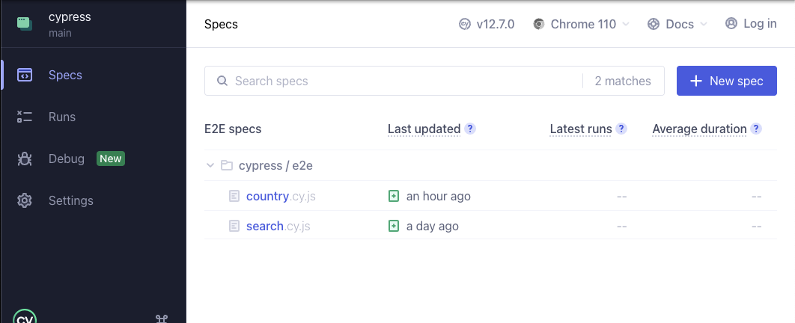
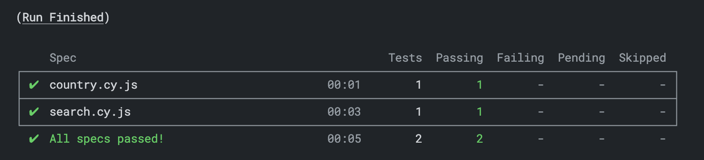
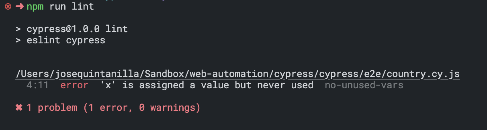

# Overview

This is a basic implementation of [Cypress](https://docs.cypress.io/guides/overview/key-differences), a popular end-to-end testing framework for web applications, to demonstrate the use of page objects, assertions on elements, and interactions with a JSON file using Cypress's `intercept` function. The implementation also includes the [ESLint plug-in](https://www.npmjs.com/package/eslint) to maintain consistent code style, especially in team environments.

If you are unfamiliar with Cypress, you may notice that the tests do not include explicit wait or pauses. This is because Cypress handles waiting automatically.

# Getting Started

## Prerequisites

Before getting started with this implementation, you need to ensure that [NodeJS](https://nodejs.org/en/download/) is installed on your machine. If NodeJS is not installed, please download and install it from the [official website](https://nodejs.org/en/download/).

## Steps

Clone the repo. Here is one method:

```
git clone git@github.com:OlllllllO/web-automation.git
```

After cloning the repository, navigate to the Cypress directory by running:

```
cd web-automation/Cypress
```

Next, install the dependencies by running:

```
npm install
```

This command will install all the necessary dependencies that are specified in the [package.json](package.json) file.

## Running Tests

Cypress provides a couple of ways to run the tests.

### UI

To run the tests in the Cypress UI, run the following command:

```
npm run cy:open
```

From the list, select a test to run



### Headless

To run all tests without launching the browser

```
npm run cy:run
```

Results will be displayed in the terminal



## Lint

To maintain a consistent code style, this implementation uses [ESLint](https://eslint.org/docs/latest/use/core-concepts) to detect and report on patterns in the code that may be problematic. To run the linter, execute the following command:


```
npm run lint
```

This command will run the linter on all the files in the Cypress directory and its subdirectories, and report any errors that it finds. The command is defined in the [package.json](package.json) file.

### Lint Error

If the linter detects any errors, it will display them in the terminal. An example of a lint error is shown below:




### Fix Errors

To fix the errors automatically, you can run the command below. It will attempt to fix the errors that it can and report any errors that it cannot fix.

```
npm run lint:fix
```